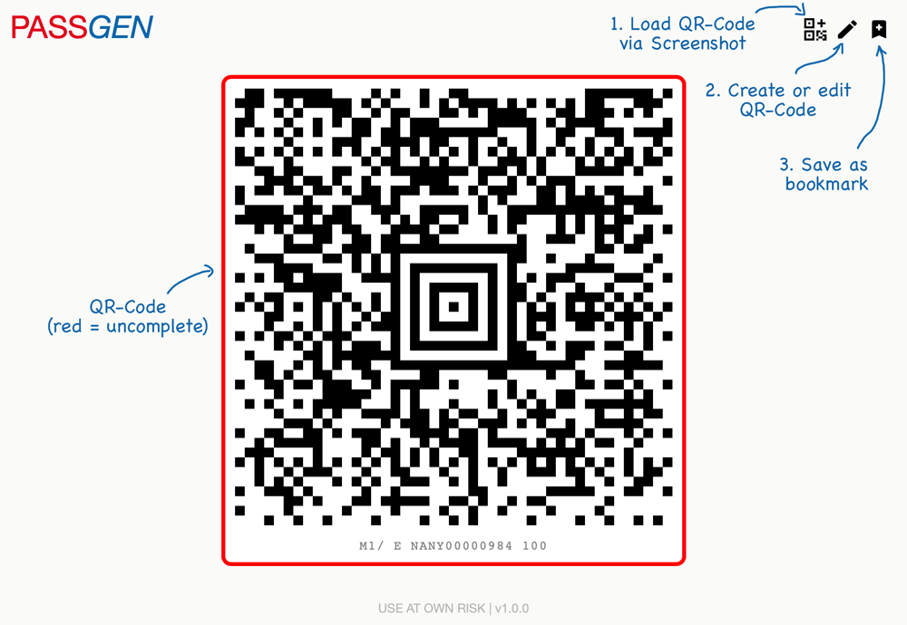

# BoardingPass QR-Code Generator

  

This is a frontend for the Barcode Generator from [Shooshx](https://github.com/shooshx/BoardingBarcode). Its has the following additional features:

* Responsive lightweight UI
* A way to save permalink for generated QR Code
* Upload existing QR Code (cropped)
* Settings modal box

You can open the tool [here](https://bitnulleins.github.io/BoardingPass-QR-Code-Generator/).

## UI and manual



## How it works

The data on the boarding passes are coded according to a specific [IATA standard](https://www.iata.org/contentassets/1dccc9ed041b4f3bbdcf8ee8682e75c4/2021_03_02-bcbp-implementation-guide-version-7-.pdf). In this process, certain data in the raw text is stored in a QR code, e.h. John Doe with Bookingref XYZ123.

```
M1DOE/JOHN EXYZ123 HAM 192F010F0001 100
  --- ----  ------
   |    |     |
   |    |     |
Surname | Booking-Ref      ...
        |
    Prename
```

This information is then encoded in a QR code so that it can be read by machine by the inspection bodies. There are two standards "aztec" (2D QR code) or PDF417 (1D code known by many airlines). The raw text can now be manipulated to encode other information.

> [!IMPORTANT]
> That's why it's so important to never show your board card on social media. There is a lot of personal information on it.

## Other useful info

* Airline codes:
http://www.airlineandairportlinks.com/frameset_linecode.html
* International Air Transport Association airport code:
http://www.airportcodes.org/

# Dislcaimer

This tool is intended for educational purposes only, use at your own personal risk.
